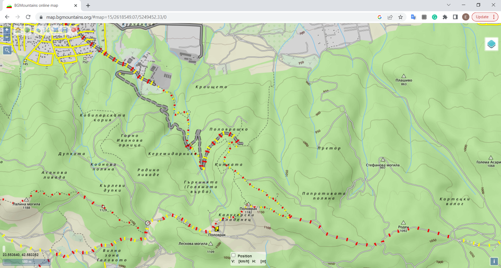

# GpxGridGenerator

The GpxGridGenerator project is a tool designed to divide a given land area into smaller squares in order to conduct full-scale search and rescue operations.

## Description

The University Rescue Squad is a first responders rescue organization in Bulgaria that conducts search and rescue (SaR) operations in all kinds of natural terrain. To ensure a complete and thorough search of a particular area, rescuers split the area into smaller quadrants that are later utilized for better navigation, more specific task setting for different SaR teams, and easier tracking of what areas have already been searched.

The GpxGridGenerator project helps SaR operations by providing a .gpx file with a grid of quadrants in a given area where rescuers need to work. This .gpx file is sent to mobilized-teams, imported into GPS devices, and later used for easier communication with operational headquarters.

## Installation

An executable file can be downloaded from here.

## Usage

To use GpxGridGenerator, simply run the GpxGridGenerator.exe file. A console should pop up, asking for input of the longitude and latitude in decimal degrees (of the down left most point of the particular area), width and height of the area, and quadrant width.

After entering the required input, GpxGridGenerator creates two .gpx files in the directory of the .exe file: grid.gpx and grid_with_names.gpx.

The grid.gpx file contains a grid of quadrants (routes) that divide the area into equal squares.

The grid_with_names.gpx file contains the same grid with additional GPS points in the down left corner of each quadrant. The points names correspond to the quadrant name.

## Limitations

The GpxGridGenerator project can only work with decimal degrees lat/long format.

The tool is developed for the needs of SaR team in Bulgaria and is not tested in different latitudes and longitudes. I presume it will not work as expected around the poles and around the 180th meridian.

Also this tool is designed to cover relatively small areas of land (rarely more than 15-20km radius). It presumes the Earth is a perfect sphere with a radius of 6,371,000 meters. Which means that the bigger the grid, the bigger the error.

## Contributing

If you have a feature request or bug report, leave an issue on the issues page or send a pull request.

## License

GpxGridGenerator is licensed under the MIT License:

Copyright (c) [2023] [Emil Nikolov, deputy head of University Rescue Squad]

Refer to the [LICENSE](LICENSE) for detailed information.

## Acknowledgments

The project is usually used with the map provided by 
https://bgmountains.org/bg/ - https://map.bgmountains.org/.